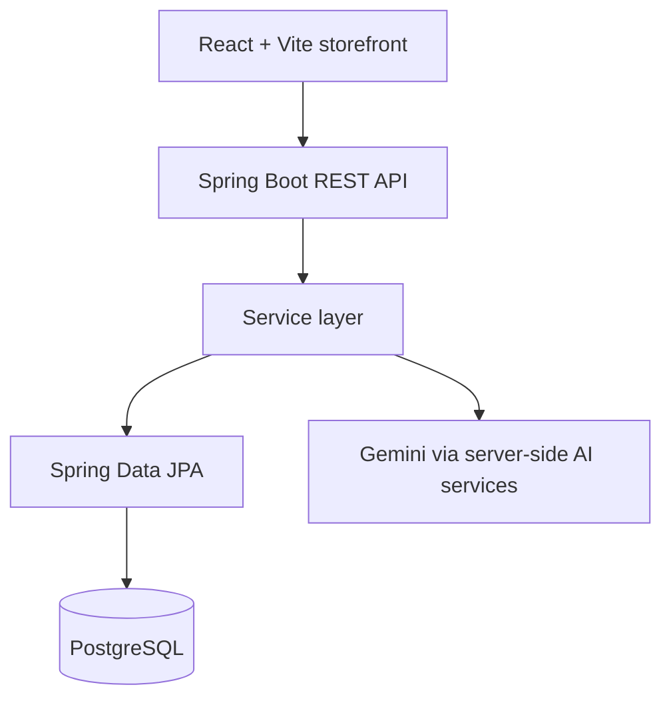

# Architecture

The current Phase 1 slice establishes the frontend shell and the authentication boundary. All credentials remain server-side; the frontend will call `/api` endpoints through a typed service layer as commerce features are added.
